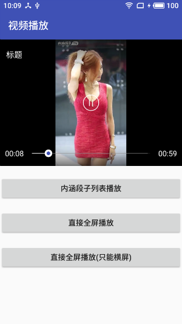

[](https://jitpack.io/#ashLikun/EasyMedia)


EasyMedia项目简介
        视频播放
## 使用方法

       build.gradle文件中添加:
```gradle
allprojects {
    repositories {
        maven { url "https://jitpack.io" }
    }
}
```
并且:

```gradle
dependencies {
    //核心库
    compile 'com.github.ashLikun:EasyMedia:{latest version}'
    //使用Ijkplay
    compile 'tv.danmaku.ijk.media:ijkplayer-java:0.8.4'
    //so文件
    compile 'com.github.ashLikun.ijkplayer:lite:0.0.1'//最小库
    compile 'com.github.ashLikun.ijkplayer:lite_hevc:0.0.1'//最小库（带hevc）
    compile 'com.github.ashLikun.ijkplayer:default:0.0.1'//最大库（支持格式多）
}
```
        

## 详细介绍

## 截图
 


 

## 使用
####    权限
          <uses-permission android:name="android.permission.INTERNET" />
              <uses-permission android:name="android.permission.WRITE_EXTERNAL_STORAGE" />
              <uses-permission android:name="android.permission.READ_EXTERNAL_STORAGE" />
              <uses-permission android:name="android.permission.MOUNT_UNMOUNT_FILESYSTEMS" />
              <uses-permission android:name="android.permission.SYSTEM_ALERT_WINDOW" />
####    引用View
             <com.ashlikun.media.EasyVideoPlayer
                          android:id="@+id/mediaPlay"
                          android:layout_width="match_parent"
                          android:layout_height="250dp"
                          app:evp_full_screen_enable="false"></com.ashlikun.media.EasyVideoPlayer>
####    Java代码

        //全局初始化（applicable）
        MediaUtils.init(getApplicationContext());
        MediaUtils.setMediaInterface(new EasyMediaIjkplayer());//使用ijkplay播放需要引入库
        MediaUtils.setMediaInterface(new EasyMediaSystem());//使用原生播放器
        也可以自己实现播放器，只需实现EasyMediaInterface接口，然后设置给EasyMedia

        //最简单的
        mediaPlay.setDataSource(new MediaData.Builder()
                        .title("标题")
                        .url(videoUrl)
                        .builder());
        //设置宽高比，内部会根据宽度自动计算高度，也有最大高度限制
        videoPlayer.setVideoRatio(s.getWidth(), s.getHeigth());

        //直接全屏
         MediaUtils.startFullscreen(new EasyVideoPlayer(this), videoUrl, "标题");

        //直接全屏 不可竖屏
         EasyVideoPlayer easyVideoPlayer = new EasyVideoPlayer(this);
         easyVideoPlayer.setFullscreenPortrait(false);
         MediaUtils.startFullscreen(easyVideoPlayer, videoUrl, "标题");

         //RecyclerView列表
         videoPlayer.setVideoRatio(s.getWidth(), s.getHeigth());
         videoPlayer.setCurrentScreen(MediaScreenStatus.SCREEN_WINDOW_LIST);
         videoPlayer.setDataSource(s.getVideoUrl(), s.getText());

         //列表滚动 自动小窗口
          recyclerView.addOnChildAttachStateChangeListener(new RecyclerView.OnChildAttachStateChangeListener() {
                     @Override
                     public void onChildViewAttachedToWindow(View view) {
                         EasyVideoPlayer videoPlayer = view.findViewById(R.id.videoPlay);
                         MediaUtils.onRecyclerAutoTiny(videoPlayer, false);
                     }

                     @Override
                     public void onChildViewDetachedFromWindow(View view) {
                         EasyVideoPlayer videoPlayer = view.findViewById(R.id.videoPlay);
                         MediaUtils.onRecyclerAutoTiny(videoPlayer, true);
                     }
                 });

         //RecyclerView Item不可见时候自动销毁
         MediaUtils.onRecyclerRelease(videoPlayer);

         //listView  列表滚动时候
         MediaUtilsd onScrollReleaseAllVideos(int currentPlayPosition, int firstVisibleItem, int visibleItemCount)
         MediaUtilsd onScrollAutoTiny(int currentPlayPosition, int firstVisibleItem, int visibleItemCount)

         //显示占位图
          GlideUtils.show(videoPlayer.getThumbImageView(), "http://p3.pstatp.com/" + s.getImageUrl());


         //生命周期
           @Override
             public void onBackPressed() {
                 if (MediaUtils.backPress()) {
                     return;
                 }
                 super.onBackPressed();
             }

             @Override
             protected void onPause() {
                 super.onPause();
                 MediaUtils.onPause();
             }

             @Override
             protected void onResume() {
                 super.onResume();
                 MediaUtils.onResume();
             }

             @Override
             protected void onDestroy() {
                 super.onDestroy();
                 MediaUtils.releaseAllVideos();
             }

        //之定义播放器样式

        1:继承EasyVideoPlayer，从写
                                public MediaControllerInterface getController() {
                                    return new EasyMediaController(getContext());
                                }
                                也可以直接调用initController方法

        2：实现自己的EasyMediaController（控制器）,可以直接继承EasyMediaController，从写getLayoutId,getControllerViewHolder方法实现控制器界面展示

        3:EasyControllerViewHolder  控制器的界面设置类


